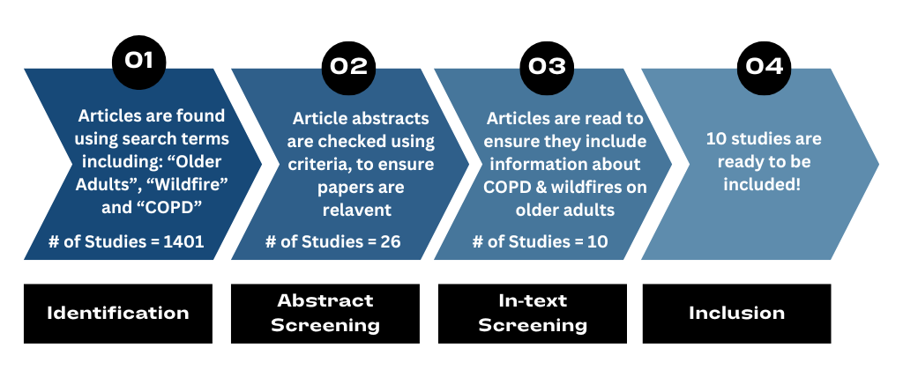

<h1 align="center">Effect of Wildfire Smoke on COPD in Older Adults: An Executive Summary</h1>

## Introduction  
Climate change is increasing global temperatures through the accumulation of greenhouse gases in our atmosphere.1 When temperatures increase, there is a higher likelihood for wildfires to occur. They release smoke and other small particles into the atmosphere which can cause damage to the lungs.2 Chronic obstructive pulmonary disease (COPD) is a lung disease causing breathing problems that is triggered by exposure to fine smoke particles. COPD is most prevalent in older adults aged 65 or older.3 Since aging populations worldwide are growing, we wanted to investigate if smoke from wildfires has an effect on COPD in older adults. 

## Methods   
To conduct this research we followed the methods of a systematic review (Figure 1). This involved developing search terms to input in five scientific databases. The papers generated were uploaded to the software Covidence. We also established criteria for selecting studies that will be included in the review and to reject the studies that do not fit the review. We sorted through available papers and found ten that fit the criteria. We then went through each study in depth and picked out information required for our analysis.
  
   
  
<strong>Figure 1.</strong><em> A flow chart outlining the general steps we took to identify the 10 papers we used in our systematic review. </em>

## Results   
Of the ten papers reviewed, they evaluated the count of hospital admissions, emergency department visits, or outpatient visits for older adults with COPD, and mortality.4–13 Some papers evaluated more than one outcome.4 Since older adults can have other age-related health conditions that can be worsened by wildfires, we hypothesized that there would be a significant impact of wildfires on COPD in older adults. However, the results of our study disprove the hypothesis as the majority of the studies found no statistical significance for COPD in older adults due to wildfire smoke. Of the four studies that evaluated emergency department visits, only one found a significant increase using statistical analyses.5,7,11,13 Out of the five studies that investigated hospital admissions, there was also only one with statistical significance.7,8,10,12,13 The study that looked at outpatient visits found a significant increase for the period after the wildfire.6 Two studies investigated mortality rates and only one found a significant increase.9,10

## Discussion:  
While the lack of statistically significant results may seem counterintuitive, it may be explained by the fact that older adults are already more at risk of getting COPD, meaning wildfire smoke is not responsible for an increase in COPD.14 Another explanation could be that older adults are exposed to less smoke because they tend to have reduced mobility, therefore limiting their exposure to the outdoor environment.15 As climate change increases the frequency and severity of wildfires, we expect to see future research that will clarify our findings. 

## Conclusion   
The results of our study could help inform the allocation of resources within healthcare systems in response to wildfires and indicate where future research is required. Further studies should investigate this topic across more geographical regions to reduce potential bias and to protect vulnerable populations around the world. 

## Bibliography  
1\.	Mansoor S, Farooq I, Kachroo MM, et al. Elevation in wildfire frequencies with respect to the climate change. *Journal of Environmental Management*. 2022;301:113769. doi:10.1016/j.jenvman.2021.113769  
2\.	Rennard SI. COPD: Overview of Definitions, Epidemiology, and Factors Influencing Its Development. *CHEST*. 1998;113(4):235S-241S. doi:10.1378/chest.113.4\_Supplement.235S  
3\.	Divo MJ, Marin JM, Casanova C, et al. Comorbidities and mortality risk in adults younger than 50 years of age with chronic obstructive pulmonary disease. *Respiratory Research*. 2022;23(1):267. doi:10.1186/s12931-022-02191-7  
4\.	Stowell JD, Geng G, Saikawa E, et al. Associations of wildfire smoke PM2.5 exposure with cardiorespiratory events in Colorado 2011–2014. *Environment International*. 2019;133:105151. doi:10.1016/j.envint.2019.105151  
5\.	Rappold AG, Stone SL, Cascio WE, et al. Peat Bog Wildfire Smoke Exposure in Rural North Carolina Is Associated with Cardiopulmonary Emergency Department Visits Assessed through Syndromic Surveillance. *Environmental Health Perspectives*. 2011;119(10):1415-1420. doi:10.1289/ehp.1003206  
6\.	Mahsin MD, Cabaj J, Saini V. Respiratory and cardiovascular condition-related physician visits associated with wildfire smoke exposure in Calgary, Canada, in 2015: a population-based study. *International Journal of Epidemiology*. 2022;51(1):166-178. doi:10.1093/ije/dyab206  
7\.	Thilakaratne R, Hoshiko S, Rosenberg A, Hayashi T, Buckman JR, Rappold AG. Wildfires and the Changing Landscape of Air Pollution–related Health Burden in California. *Am J Respir Crit Care Med*. 2023;207(7):887-898. doi:10.1164/rccm.202207-1324OC  
8\.	Morgan G, Sheppeard V, Khalaj B, et al. Effects of Bushfire Smoke on Daily Mortality and Hospital Admissions in Sydney, Australia. *Epidemiology*. 2010;21(1):47. doi:10.1097/EDE.0b013e3181c15d5a  
9\.	Doubleday A, Schulte J, Sheppard L, et al. Mortality associated with wildfire smoke exposure in Washington state, 2006–2017: a case-crossover study. *Environmental Health*. 2020;19(1):4. doi:10.1186/s12940-020-0559-2  
10\.	Mott JA, Mannino DM, Alverson CJ, et al. Cardiorespiratory hospitalizations associated with smoke exposure during the 1997 Southeast Asian forest fires. *International Journal of Hygiene and Environmental Health*. 2005;208(1):75-85. doi:10.1016/j.ijheh.2005.01.018  
11\.	Johnston FH, Purdie S, Jalaludin B, Martin KL, Henderson SB, Morgan GG. Air pollution events from forest fires and emergency department attendances in Sydney, Australia 1996–2007: a case-crossover analysis. *Environ Health*. 2014;13(1):105. doi:10.1186/1476-069X-13-105  
12\.	Delfino RJ, Brummel S, Wu J, et al. The relationship of respiratory and cardiovascular hospital admissions to the southern California wildfires of 2003\. *Occupational and Environmental Medicine*. 2009;66(3):189-197. doi:10.1136/oem.2008.041376  
13\.	Reid CE, Jerrett M, Tager IB, Petersen ML, Mann JK, Balmes JR. Differential respiratory health effects from the 2008 northern California wildfires: A spatiotemporal approach. *Environmental Research*. 2016;150:227-235. doi:10.1016/j.envres.2016.06.012  
14\.	Mannino DM. COPD: Epidemiology, Prevalence, Morbidity and Mortality, and Disease Heterogeneity. *CHEST*. 2002;121(5):121S-126S. doi:10.1378/chest.121.5\_suppl.121S  
15\.	Phillips J, Walford N, Hockey A, Foreman N, Lewis M. Older people and outdoor environments: Pedestrian anxieties and barriers in the use of familiar and unfamiliar spaces. *Geoforum*. 2013;47:113-124. doi:10.1016/j.geoforum.2013.04.002  
